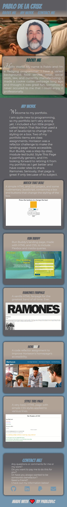
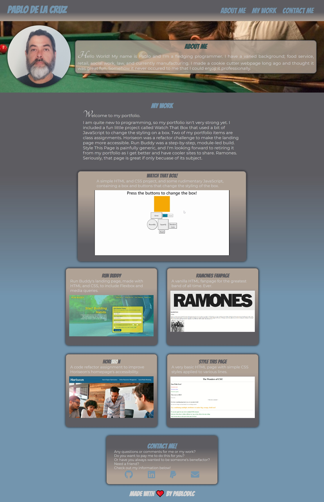

# professional-portfolio

## Description
A portfolio for the up-and-coming programmer pablodlc, written using the guidelines from the User Story and Acceptance Criteria below.

### User Story
> AS AN employer  
> I WANT to view a potential employee's deployed portfolio of work samples  
> SO THAT I can review samples of their work and assess whether they're a good candidate for an open position  

### Acceptance Criteria
>GIVEN I need to sample a potential employee's previous work  
>WHEN I load their portfolio  
>THEN I am presented with the developer's name, a recent photo, and links to sections about them, their work, and how to contact them  
>WHEN I click one of the links in the navigation  
>THEN the UI scrolls to the corresponding section  
>WHEN I click on the link to the section about their work  
>THEN the UI scrolls to a section with titled images of the developer's applications  
>WHEN I am presented with the developer's first application  
>THEN that application's image should be larger in size than the others  
>WHEN I click on the images of the applications  
>THEN I am taken to that deployed application  
>WHEN I resize the page or view the site on various screens and devices  
>THEN I am presented with a responsive layout that adapts to my viewport
  
## Application
Visit my portfolio by clicking [here](https://pablodlc.github.io/professional-portfolio/).  
My portfolio contains a breif bio, a section called My Work that includes five pages I've wokred on, and a Contact Me section with links to my Github, LinkedIn, PayPal, and email.  
Using Flexbox and Media queries, I designed my prtfolio to be responsive, targeting screen widths 1024px, 768px, 600px, and 480px.  
Check out the screenshots of my site below.  In the interest of brevity, I included just my site at 480px and full size.  
  
  
  

<!-- Link to page
 Describe page by sections
Include GIF of app -->

## Future Developments
Continual updates as my knowledge and portfolio grows and improves.

## Technologies Used
- HTML
- CSS, to include Flexbox and Media Queries

## Reference Material
- *Run Buddy* for Flexbox reference, HTML structure, and Header set up
- https://visme.co/blog/website-color-schemes/ for color scheme inspiration.
- https://www.freecodecamp.org/news/how-to-use-html-to-open-link-in-new-tab/ for how to open a link in a new tab and the `noopener` and `norefferer` `rel` attributes.
- fonts.google.com for fun fonts
- https://www.w3schools.com/colors/colors_gradient.asp for fun gradients
